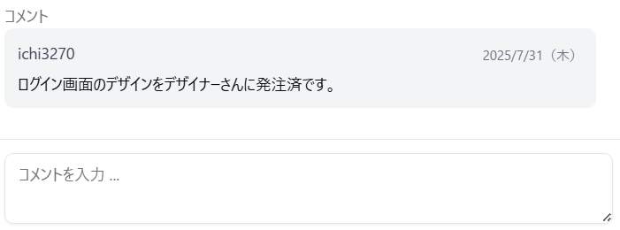
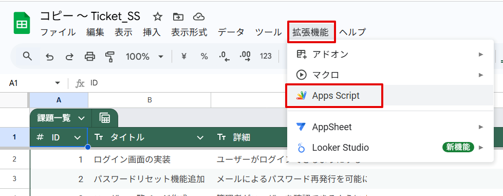

# Ticket.SS

Ticket.SS は、Google スプレッドシートで作成された管理表（課題一覧、Q&A 一覧・・・など）をちょっと使いやすくするツールです。

このような、よくあるスプレッドシートの管理表が・・・  

Web アプリとして使えるようになります。  

## サンプル

[WEB アプリ](https://script.google.com/macros/s/AKfycbxscNX2SYgkEjKTE62nPMNP63xB69wmzIacQy9YHSfFMavooFiGgTtMTflNqEuKXI_p/exec)

ゲストユーザーとして閲覧・登録・更新が可能です。

※ 個人情報・機密情報・誹謗中傷などのデータ登録はしないでください。  
※ 登録されたデータは毎日 0 時に初期化されます。

[スプレッドシート](https://docs.google.com/spreadsheets/d/1bH-SjREqMW5s-KWurP7vRNJYBhLk5nYXcUh2TnPRTQc/edit?usp=sharing)

スプレッドシートは閲覧のみ可能です。

## 使用方法

1. [コピー用ページ](https://docs.google.com/spreadsheets/d/1HKVPRi7Qyz1Xwme5stQzeRWSfuhWj4o0pmkKktDwbUU/copy)を開き「コピーを作成」ボタンを押す。  
   

   テンプレートがマイドライブにコピーされます。ほかのフォルダに移動したり、ファイル名を変更しても問題ありません。  
   

2. 「課題一覧」や「QA 一覧」シートはあくまでサンプルです。  
   お好みの表に編集してください。項目名やシート名を変更しても問題ありません。  
   ※ 1 行目がヘッダー行、2 行目以降はデータ行の形式にしてください。  
   ※ テーブル形式でない通常の表でも問題ありません。

3. データ形式の定義
   「.schema」シートに、データの形式を登録してください。
   
   | 列 | 設定内容容 |
   | ------------ | ----------------------------------------------------------------------------------------------------------------------------------------------------------- |
   | sheetName | シートの名前 |
   | fieldName | 項目名。データシート上の列名と一致させてください。（全項目を選択してコピーして、右クリックメニュー「特殊貼り付け」→「転置して貼り付け」を使うと簡単です。） |
   | isId | ID となる項目にチェック。1 つのシートにつき、必ず 1 項目を選択してください。 |
   | isTitle | タイトルとなる項目にチェック。1 つのシートにつき 1 項目指定できます。 |
   | type ※ | 項目の形式を選択してください。この設定により、WEB 画面の入力フィールドの形式が変わります。 |
   | editable | 編集を許可する項目にチェック。未チェックの項目は、編集画面で入力欄が非活性になります。 |
   | shownInTable | WEB 画面の一覧表に表示する項目にチェック。未チェックの項目は、一覧表に表示されません。（登録画面・編集画面には表示されます） |
   | enableFilter | WEB 画面の一覧表でフィルタを有効にする項目にチェック。 |
   | options | 「type」を「select」にした場合、プルダウンの選択肢をカンマ区切りで入力。<入力例> 低,中,高 |

   ※ type の設定値一覧  
   `text`:  
    

   `textarea`:  
    

   `select`:  
    

   `date`:  
    

   `comments`:  
    

4. 利用者の登録  
    「.users」シートに利用者を登録してください。  
    avatar には画像の URL を設定してください。（不要な場合は空白でも問題ありません。）
   

5. デプロイ  
   拡張機能 > Apps Script でスクリプトエディタを開く  
   

   `デプロイ` > `新しいデプロイ`  
   

   `次のユーザーとして実行`は自分を選択、`アクセスできるユーザー`は用途にあわせて選択してください。  
   （「Google アカウントを持つ全員」、「全員」は、全世界にデータが公開されますので注意してください）  
   

   `アクセスを承認`をクリックし、表示される画面に従ってデータへのアクセスを許可してください。  
   

   承認が完了したら、ウェブアプリの URL が表示され、アプリが利用可能になります。  
   

## 今後実現したいこと

[サンプルアプリ](https://script.google.com/macros/s/AKfycbxscNX2SYgkEjKTE62nPMNP63xB69wmzIacQy9YHSfFMavooFiGgTtMTflNqEuKXI_p/exec)の「Ticket.SS ToDo」にまとめています。
